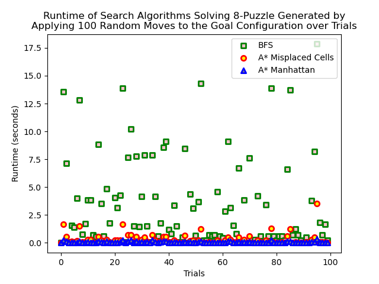
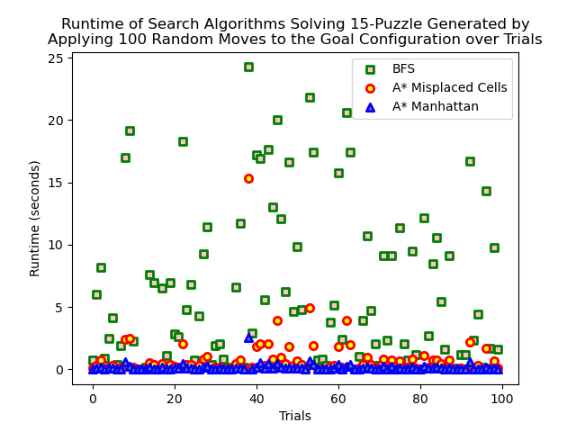

# N-Puzzle
Applying Breadth First Search (BFS), Uniform Cost Search (UCS), and A* Search to solve n-puzzle of any size. 
Two heuristic functions are used for A* Search:
1. the number of misplaced cells
2. the sum of manhattan distance between the cells and their goal positions.

# Performance plot
The plots do not include runtime of UCS since its performance is much worse than the others. Including it in the same plot would make the dots seem to be outliers.

# Acknowledgement
This project is inspired by and extended from Project 1 of UC Berkeley CS 188: Introduction to Artificial Intelligence, part of which uses BFS to solve 8-puzzle.
